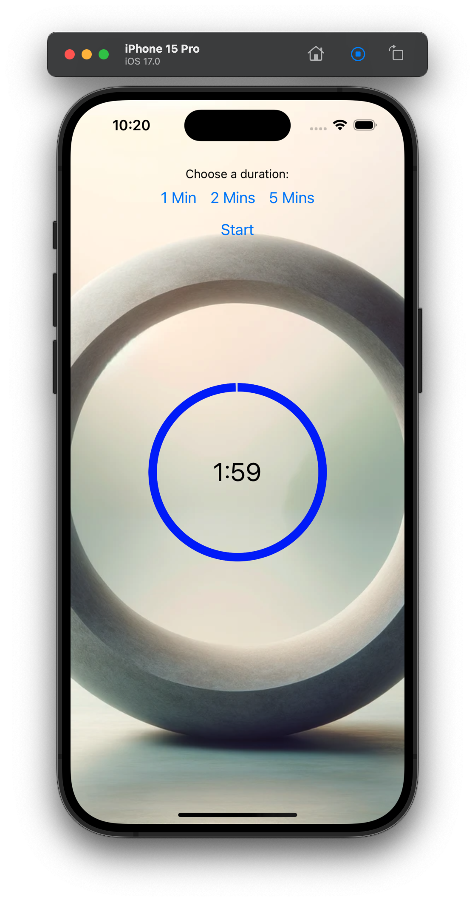

# Lazy Buddha
is a meditation timer without the usual bloat and freemium nonsense. It's free and open source, and it will (soon) be available for Android and iOS.

## Why?
I wanted a simple meditation timer that I could use on my phone. I didn't want to pay for it, and I didn't want to be tracked or have ads. I also didn't want to have to create an account or log in. I just wanted to meditate.

## Features
- Simple, intuitive interface
- No ads, no tracking, no analytics
- No in-app purchases
- No internet connection required
- No permissions required
- Open source
- Free

## Download
- TBD

## Build
- Install [Node.js](https://nodejs.org/en/)
- Install [Expo CLI](https://docs.expo.io/workflow/expo-cli/)
- Clone this repo
- Run `npm install`
- Run `expo start`
- Follow the instructions to run the app on your device or emulator.

## License
[MIT](https://choosealicense.com/licenses/mit/)

## Credits
- [React Native](https://reactnative.dev/)
- [Expo](https://expo.io/)
- [React Native Paper](https://callstack.github.io/react-native-paper/)
- FreeToUseSounds for the [background sounds](https://freetousesounds.com/)
- [DallE](https://openai.com/blog/dall-e/) for the background images.
